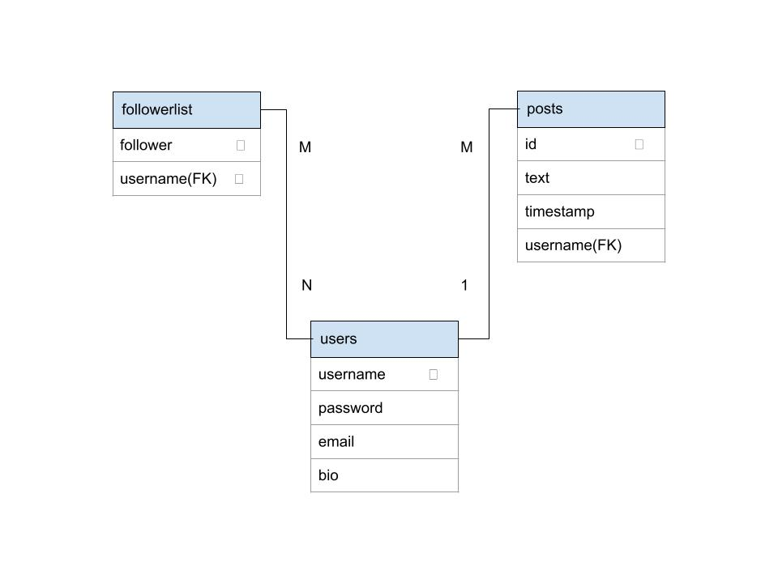

# Twitter-API
Twitter API clone containing user data and tweet timelines.

# API url pattern
<method> - https://<url>/<end-route>/<slug(s)>

# End routes for users
  - /users - to create a user
  - /users/<username>/<password> - to authenticate user
  - /users/update - to edit user bio
  - /users/all - to get all of the users
  - /users/followers/add/<username> - add a follower
  - /users/followers/remove/<username> - remove a follower
  - /users/followers/all/<username> - get all followers from that user
  
# End routes for user timelines
  - /tweets/<username> - post a tweet
  - /tweets/delete/<username> - delete a tweet
  - /tweets/timeline/public - get the public timeline
  - /tweets/timeline/user/<username> - get the timeline of a specific user
  - /tweets/timeline/home/<username> - get the home timeline

# app.py file
- Acts as the main driver file. Contains functions that run both (users) and (tweets) blueprints.

# users.py file
- Contains business logic for example: user authentication, following other users, and handling overall user requests and responses.

# tweets.py file
- Manages the timelines of each tweet along with the the actual publishing of tweets.

# Database schema 

